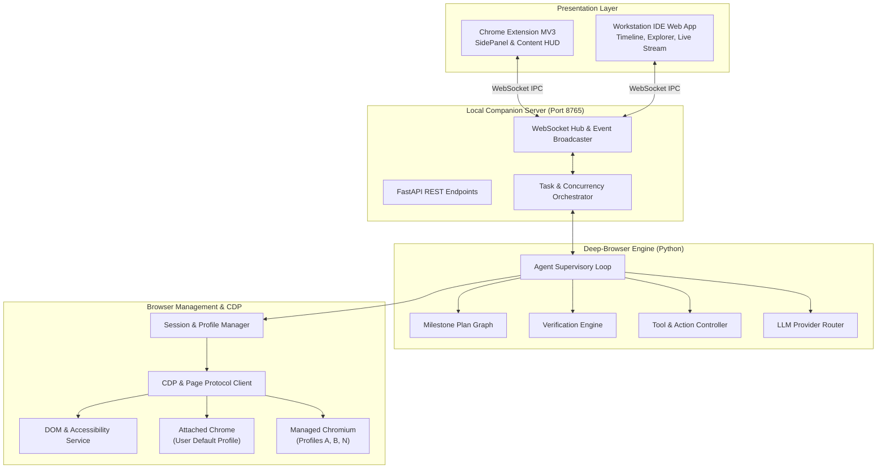

# 02. Architecture Specification

## 🏗️ High-Level System Topology

Deep-Browser adopts a layered client-server-runtime topology designed for ultra-low latency, robust state synchronization, and complete local execution.

---

## 🧩 Component Breakdown

### 1. Presentation Layer
- **Chrome Extension MV3**: Lightweight UI entry point embedded in Chrome. Interacts with the local companion server over a secure local WebSocket connection (`ws://127.0.0.1:8765/ws/extension`).
- **Workstation IDE**: Rich, single-page application served directly by the companion server (`http://127.0.0.1:8765`), offering deep inspection of agent internal state, milestone trees, DOM trees, and artifacts.

### 2. Companion Server
- Implemented with **FastAPI** and **uvicorn**.
- Manages client subscriptions, streams real-time agent execution events, coordinates human-in-the-loop approvals, and exposes REST endpoints for task submission and file downloads.

### 3. Deep-Browser Engine
- **Agent Supervisory Loop**: Executes the core reasoning cycle, managing token budgets, tool invocations, and retries.
- **Verification Engine**: Executes deterministic post-action assertions against the browser DOM before marking any action as `VERIFIED`.
- **Model Router**: Translates uniform agent prompts into provider-specific payloads (Gemini SDK, OpenAI SDK, Anthropic SDK, Ollama).

### 4. Browser & Session Layer
- Interacts with Chromium instances using direct Chrome DevTools Protocol (CDP) WebSocket sessions and Playwright adapters.
- Manages distinct browser profiles with full storage isolation.
