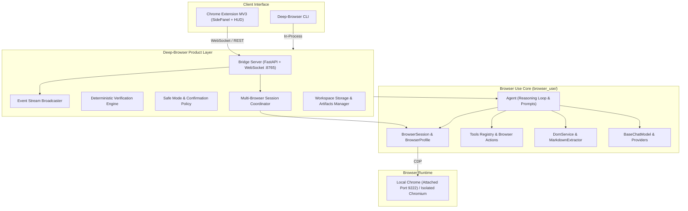

# 02. Deep-Browser Architectural Boundaries

This document defines the strict boundary between the **Browser Use Core** and the **Deep-Browser Product Layer**.

---

## 1. Architectural Separation

---

## 2. Component Ownership Matrix

### A. Browser Use Core (`browser_use/`)
*Sole owner of core browser automation and agent reasoning:*
- **Agent**: Main agent orchestration loop, prompt construction, message management (`browser_use.agent.service.Agent`).
- **BrowserSession & BrowserProfile**: CDP connection, tab lifecycle, viewport and cookie management (`browser_use.browser.session.BrowserSession`).
- **DomService**: In-page interactive element detection, coordinate extraction, tree serialization (`browser_use.dom.service.DomService`).
- **Tools**: Action decorator, parameter schemas, standard browser actions (`browser_use.tools.service.Tools`).
- **LLM Adapters**: Native bindings for Gemini, OpenAI, Anthropic, Ollama (`browser_use.llm`).

### B. Deep-Browser Product Layer (`deep_browser/`)
*Add-on product capabilities wrapping Browser Use:*
- **Bridge Server** (`deep_browser.bridge`): Local companion server on `127.0.0.1:8765` for Chrome Extension MV3 and external clients.
- **Event Streaming** (`deep_browser.events`): Structured timeline telemetry broadcasting real-time events (`TASK_STARTED`, `ACTION_REQUESTED`, `VERIFICATION`, `COMPLETED`).
- **Deterministic Verification** (`deep_browser.verification`): Invariant enforcement layer ("Never Executed == Success without observable DOM/state evidence").
- **Safe Mode Policies** (`deep_browser.policies`): Human confirmation gates before executing sensitive/destructive actions (*delete, submit, transfer*).
- **Multi-Session Coordinator** (`deep_browser.sessions`): Coordination of concurrent browser sessions in Attached vs Managed modes.
- **Workspace Storage** (`deep_browser.workspace`): Disk persistence for task histories, DOM snapshots, replay traces, and downloads in `workspace/`.

---

## 3. Core Directives

1. **Never Duplicate**: If Browser Use provides a capability (CDP, DOM extraction, BrowserSession, Agent loop), use or modify `browser_use/` directly.
2. **Deterministic Evidence**: Deep-Browser wraps all tool actions with verification receipts before marking tasks complete.
3. **Local-First**: Zero mandatory cloud infrastructure; operates over localhost CDP and local bridge.
