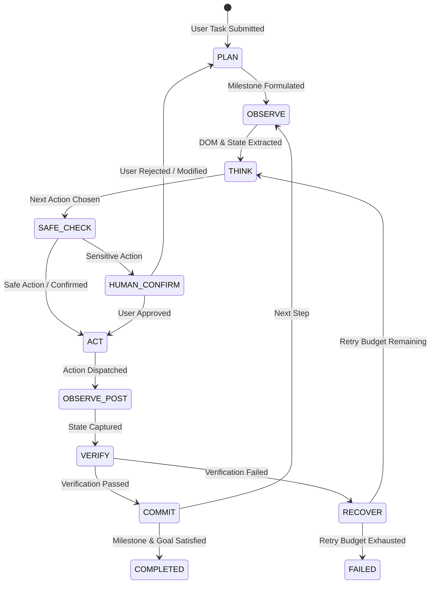

# 03. Agent Supervisory Loop & Reasoning Pipeline

## 🔄 The 6-Stage Supervisory Loop

Deep-Browser elevates traditional browser automation into a strict supervisory execution loop:

---

## 🔍 Detailed Loop Phases

### 1. PLAN
- The agent analyzes the user's high-level goal and generates or updates a structured milestone plan (e.g. `[Step 1: Search topic]`, `[Step 2: Filter results]`, `[Step 3: Extract table]`).

### 2. OBSERVE (Pre-Action)
- Extracts the interactive DOM tree, accessibility nodes, active URL, page title, viewport screenshot, and cursor position from the active browser tab.
- Indexes interactive elements with deterministic numerical IDs (`[1]`, `[2]`, `[3]`).

### 3. THINK
- The LLM reasons over the current observation, goal, milestone status, and previous action history to produce:
  - `thought`: Internal reasoning and observations.
  - `next_action`: Tool name and arguments.
  - `expected_consequence`: Explicit state assertion (e.g. "URL should become `/dashboard`" or "Input field should have value `Deep-Browser`").

### 4. SAFE_CHECK
- Assesses whether the proposed action is destructive (e.g. `submit_form`, `send_message`, `delete_data`, `purchase`).
- If policy flags the action, prompts the user via the Extension SidePanel or Workstation UI before proceeding.

### 5. ACT
- Dispatches the low-level CDP command or script to the targeted browser tab.

### 6. VERIFY & COMMIT
- Immediately reads back the DOM and browser state to evaluate the `expected_consequence`.
- If verified $\to$ updates milestone progress and proceeds to next step.
- If failed $\to$ logs failure evidence into the task timeline and generates an evidence-based self-healing prompt for the next thinking turn.
