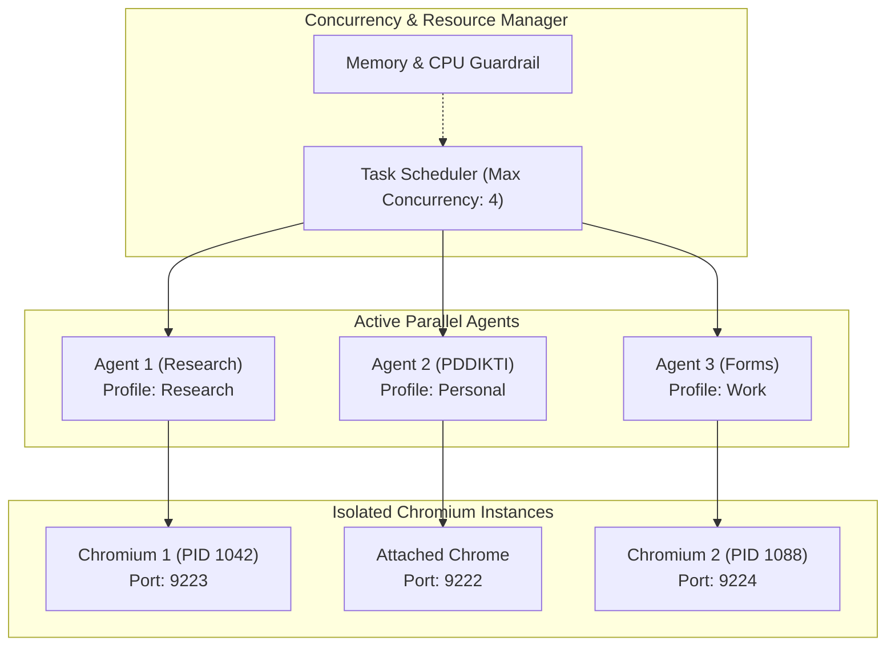

# 06. Parallel Agents & Multi-Session Concurrency

## 👥 Concurrent Agent Architecture

Deep-Browser supports running multiple autonomous agents simultaneously across isolated browser instances.

---

## 🛡️ Isolation Guarantees

1. **State Isolation**:
   - Zero shared memory or cross-talk between agents.
   - Each agent maintains its own token counter, conversation history, DOM cache, and tool registry.

2. **Resource Guardrails**:
   - Configurable `max_concurrent_browsers` (default: `3`).
   - Automatic throttling when system memory usage exceeds 85%.

3. **Independent Lifecycle & Cancellation**:
   - Cancelling or pausing Agent A has zero impact on the execution of Agent B or Agent C.
