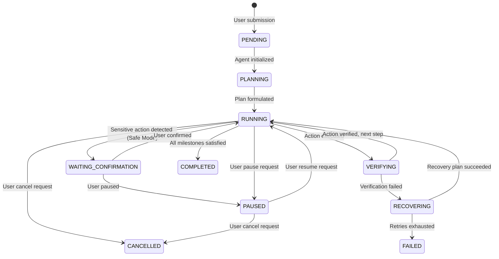

# 08. Task State Machine & Milestone Graph

## 📊 Task Lifecycle Model

Every task in Deep-Browser is represented as a formal state machine with milestones, retry budgets, and deterministic transition triggers.



---

## 📋 Task Data Schema (TypeScript / Pydantic Equivalent)

```python
class TaskMilestone(BaseModel):
    id: str
    title: str
    description: str
    status: Literal["pending", "in_progress", "completed", "failed"]
    evidence: Optional[str] = None

class TaskModel(BaseModel):
    id: str = Field(default_factory=lambda: f"task_{uuid4().hex[:8]}")
    goal: str
    status: Literal[
        "pending", "planning", "running", "waiting_confirmation",
        "verifying", "recovering", "paused", "completed", "failed", "cancelled"
    ]
    browser_mode: Literal["attached", "managed"]
    profile_id: str
    milestones: List[TaskMilestone] = []
    current_milestone_index: int = 0
    actions_count: int = 0
    retry_count: int = 0
    max_retries: int = 3
    token_usage: Dict[str, int] = {"prompt_tokens": 0, "completion_tokens": 0, "total_tokens": 0}
    elapsed_seconds: float = 0.0
    created_at: str
    updated_at: str
```
