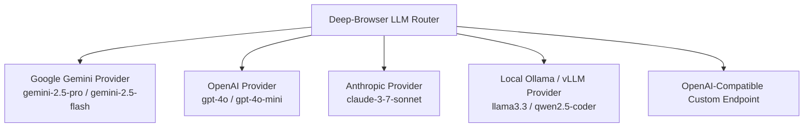

# 14. Multi-Provider LLM Routing Architecture

Deep-Browser adopts a model-agnostic provider abstraction that enables per-task or per-agent LLM configuration.

---

## 🤖 Supported Providers



---

## ⚙️ Configuration Format (`.env` or Config Object)

```env
# Default Provider
DEEP_BROWSER_DEFAULT_PROVIDER=gemini

# Provider Credentials
GEMINI_API_KEY=your_gemini_key
OPENAI_API_KEY=your_openai_key
ANTHROPIC_API_KEY=your_anthropic_key

# Local Offline Endpoint
OLLAMA_BASE_URL=http://localhost:11434/v1
OLLAMA_MODEL=qwen2.5:32b
```
